## Examples for backend: pyplot

### Initialize

```julia
using Plots
pyplot()
```

### Lines

A simple line plot of the columns.

```julia
plot(Plots.fakedata(50,5),w=3)
```

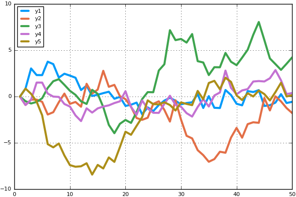

### Functions, adding data, and animations

Plot multiple functions.  You can also put the function first, or use the form `plot(f, xmin, xmax)` where f is a Function or AbstractVector{Function}.

Get series data: `x, y = plt[i]`.  Set series data: `plt[i] = (x,y)`. Add to the series with `push!`/`append!`.

Easily build animations.  (`convert` or `ffmpeg` must be available to generate the animation.)  Use command `gif(anim, filename, fps=15)` to save the animation.

```julia
p = plot([sin,cos],zeros(0),leg=false)
anim = Animation()
for x = linspace(0,10π,100) # /Users/tom/.julia/v0.4/ExamplePlots/src/example_generation.jl, line 30:
    push!(p,x,Float64[sin(x),cos(x)]) # /Users/tom/.julia/v0.4/ExamplePlots/src/example_generation.jl, line 31:
    frame(anim)
end
```

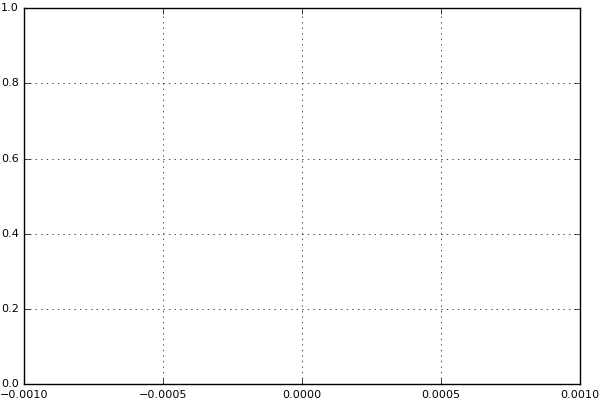

### Parametric plots

Plot function pair (x(u), y(u)).

```julia
plot(sin,(x->begin  # /Users/tom/.julia/v0.4/ExamplePlots/src/example_generation.jl, line 37:
            sin(2x)
        end),0,2π,line=4,leg=false,fill=(0,:orange))
```

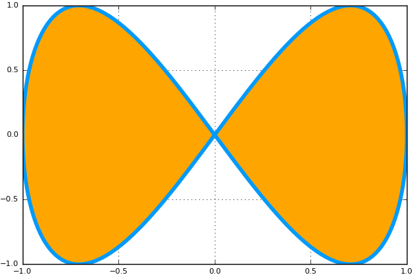

### Colors

Access predefined palettes (or build your own with the `colorscheme` method).  Line/marker colors are auto-generated from the plot's palette, unless overridden.  Set the `z` argument to turn on series gradients.

```julia
y = rand(100)
plot(0:10:100,rand(11,4),lab="lines",w=3,palette=:grays,fill=(0.5,:auto))
scatter!(y,zcolor=abs(y - 0.5),m=(:heat,0.8,stroke(1,:green)),ms=10 * abs(y - 0.5) + 4,lab="grad")
```

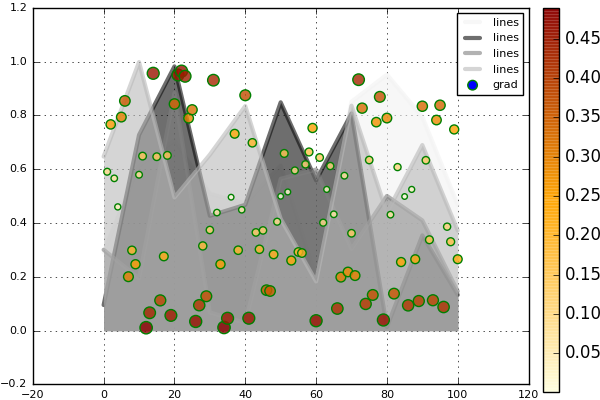

### Global

Change the guides/background/limits/ticks.  Convenience args `xaxis` and `yaxis` allow you to pass a tuple or value which will be mapped to the relevant args automatically.  The `xaxis` below will be replaced with `xlabel` and `xlims` args automatically during the preprocessing step. You can also use shorthand functions: `title!`, `xaxis!`, `yaxis!`, `xlabel!`, `ylabel!`, `xlims!`, `ylims!`, `xticks!`, `yticks!`

```julia
y = rand(20,3)
plot(y,xaxis=("XLABEL",(-5,30),0:2:20,:flip),background_color=RGB(0.2,0.2,0.2),leg=false)
hline!(mean(y,1) + rand(1,3),line=(4,:dash,0.6,[:lightgreen :green :darkgreen]))
vline!([5,10])
title!("TITLE")
yaxis!("YLABEL",:log10)
```

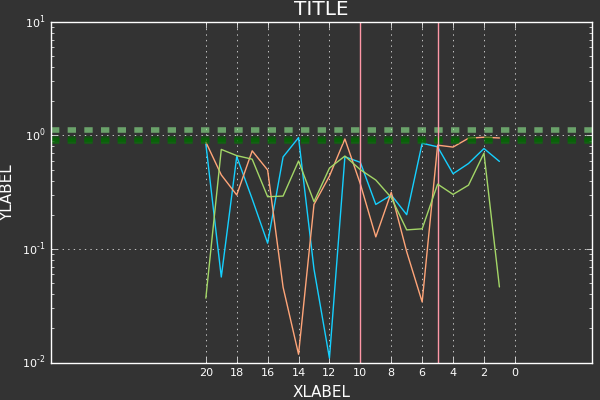

### Two-axis

Use the `axis` arguments.

Note: Currently only supported with Qwt and PyPlot

```julia
plot(Vector[randn(100),randn(100) * 100],axis=[:l :r],ylabel="LEFT",yrightlabel="RIGHT",xlabel="X",title="TITLE")
```

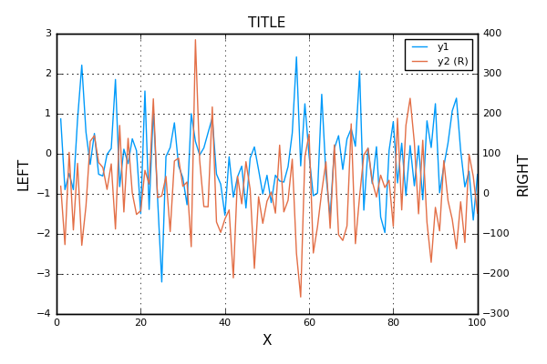

### Arguments

Plot multiple series with different numbers of points.  Mix arguments that apply to all series (marker/markersize) with arguments unique to each series (colors).  Special arguments `line`, `marker`, and `fill` will automatically figure out what arguments to set (for example, we are setting the `linestyle`, `linewidth`, and `color` arguments with `line`.)  Note that we pass a matrix of colors, and this applies the colors to each series.

```julia
ys = Vector[rand(10),rand(20)]
plot(ys,line=(:dot,4,[:black :orange]),marker=([:hex :d],12,0.8,stroke(3,:gray)))
```

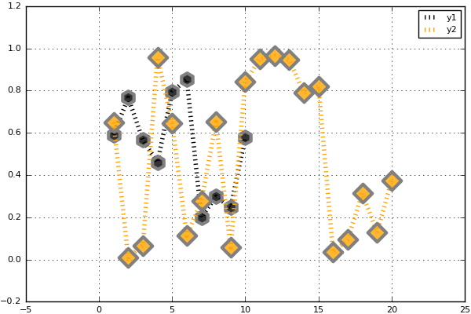

### Build plot in pieces

Start with a base plot...

```julia
plot(rand(100) / 3,reg=true,fill=(0,:green))
```

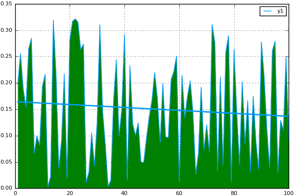

### 

and add to it later.

```julia
scatter!(rand(100),markersize=6,c=:orange)
```

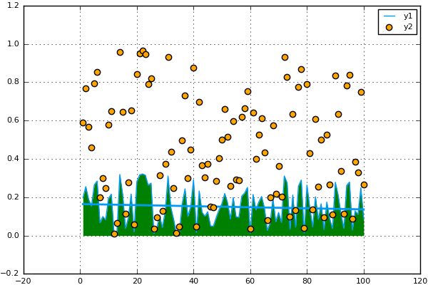

### Heatmaps


```julia
heatmap(randn(10000),randn(10000),nbins=20)
```

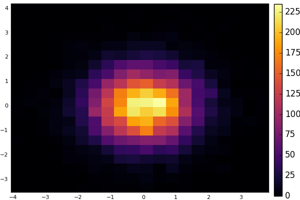

### Line types


```julia
types = intersect(supportedTypes(),[:line,:path,:steppre,:steppost,:sticks,:scatter])'
n = length(types)
x = Vector[sort(rand(20)) for i = 1:n]
y = rand(20,n)
plot(x,y,line=(types,3),lab=map(string,types),ms=15)
```

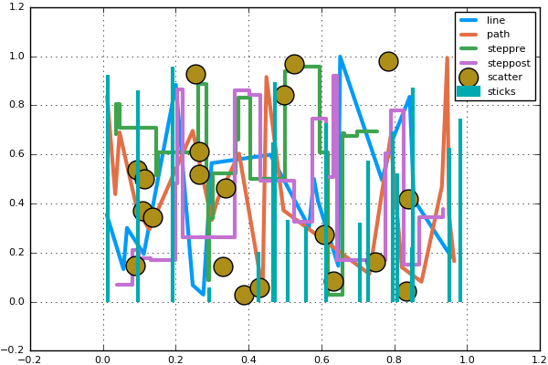

### Line styles


```julia
styles = setdiff(supportedStyles(),[:auto])'
plot(cumsum(randn(20,length(styles)),1),style=:auto,label=map(string,styles),w=5)
```

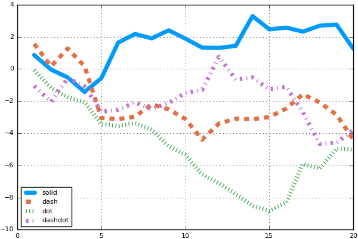

### Marker types


```julia
markers = setdiff(supportedMarkers(),[:none,:auto,Shape])'
n = length(markers)
x = (linspace(0,10,n + 2))[2:end - 1]
y = repmat(reverse(x)',n,1)
scatter(x,y,m=(8,:auto),lab=map(string,markers),bg=:linen)
```

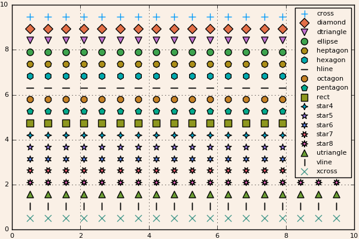

### Bar

x is the midpoint of the bar. (todo: allow passing of edges instead of midpoints)

```julia
bar(randn(999))
```

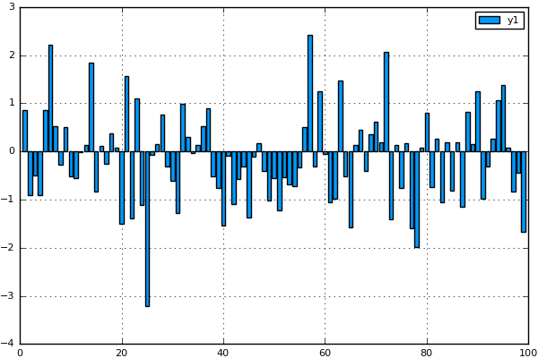

### Histogram


```julia
histogram(randn(1000),nbins=20)
```

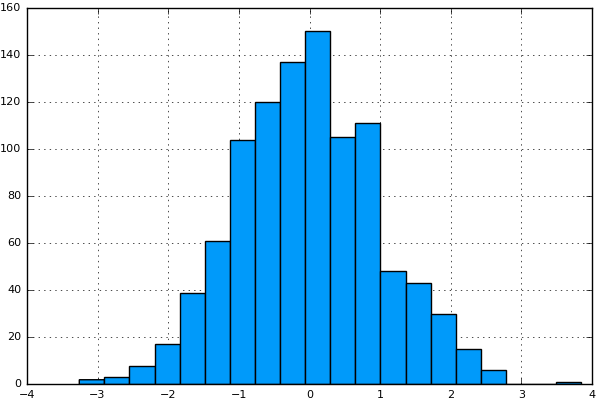

### Subplots

  subplot and subplot! are distinct commands which create many plots and add series to them in a circular fashion.
  You can define the layout with keyword params... either set the number of plots `n` (and optionally number of rows `nr` or 
  number of columns `nc`), or you can set the layout directly with `layout`.


```julia
subplot(randn(100,5),layout=[1,1,3],t=[:line :hist :scatter :step :bar],nbins=10,leg=false)
```

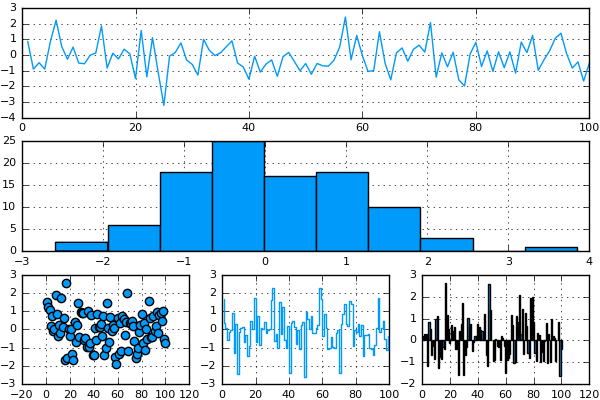

### Adding to subplots

Note here the automatic grid layout, as well as the order in which new series are added to the plots.

```julia
subplot(Plots.fakedata(100,10),n=4,palette=[:grays :blues :heat :lightrainbow],bg=[:orange :pink :darkblue :black])
```

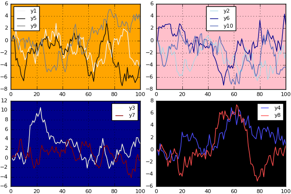

### 


```julia
subplot!(Plots.fakedata(100,10))
```

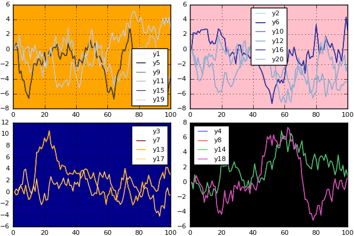

### Annotations

Currently only text annotations are supported.  Pass in a tuple or vector-of-tuples: (x,y,text).  `annotate!(ann)` is shorthand for `plot!(; annotation=ann)`

```julia
y = rand(10)
plot(y,ann=(3,y[3],text("this is #3",:left)))
annotate!([(5,y[5],text("this is #5",16,:red,:center)),(10,y[10],text("this is #10",:right,20,"courier"))])
```

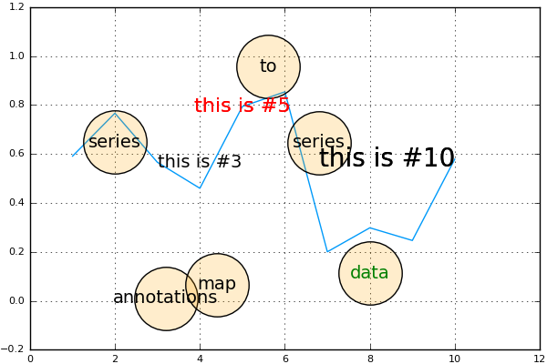

### Custom Markers

A `Plots.Shape` is a light wrapper around vertices of a polygon.  For supported backends, pass arbitrary polygons as the marker shapes.  Note: The center is (0,0) and the size is expected to be rougly the area of the unit circle.

```julia
verts = [(-1.0,1.0),(-1.28,0.6),(-0.2,-1.4),(0.2,-1.4),(1.28,0.6),(1.0,1.0),(-1.0,1.0),(-0.2,-0.6),(0.0,-0.2),(-0.4,0.6),(1.28,0.6),(0.2,-1.4),(-0.2,-1.4),(0.6,0.2),(-0.2,0.2),(0.0,-0.2),(0.2,0.2),(-0.2,-0.6)]
plot(0.1:0.2:0.9,0.7 * rand(5) + 0.15,l=(3,:dash,:lightblue),m=(Shape(verts),30,RGBA(0,0,0,0.2)),bg=:pink,fg=:darkblue,xlim=(0,1),ylim=(0,1),leg=false)
```

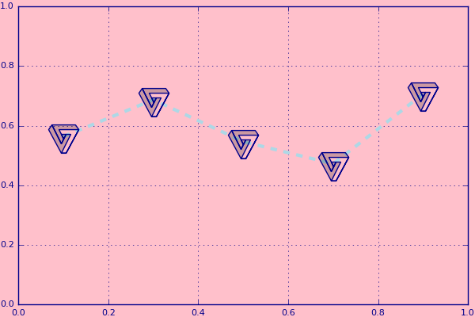

### Contours


```julia
x = 1:0.3:20
y = x
f(x,y) = begin  # /Users/tom/.julia/v0.4/ExamplePlots/src/example_generation.jl, line 172:
        sin(x) + cos(y)
    end
contour(x,y,f,fill=true)
```

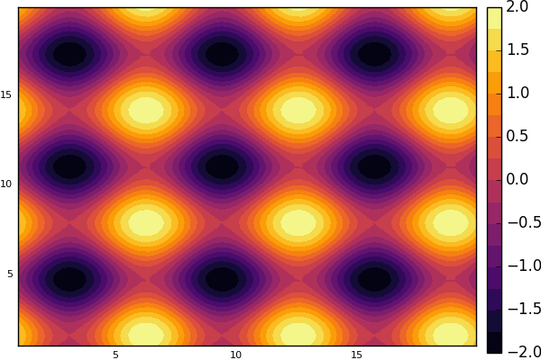

### 3D


```julia
n = 100
ts = linspace(0,8π,n)
x = ts .* map(cos,ts)
y = (0.1ts) .* map(sin,ts)
z = 1:n
plot(x,y,z,zcolor=reverse(z),m=(10,0.8,:blues,stroke(0)),leg=false,w=5)
plot!(zeros(n),zeros(n),1:n,w=10)
```

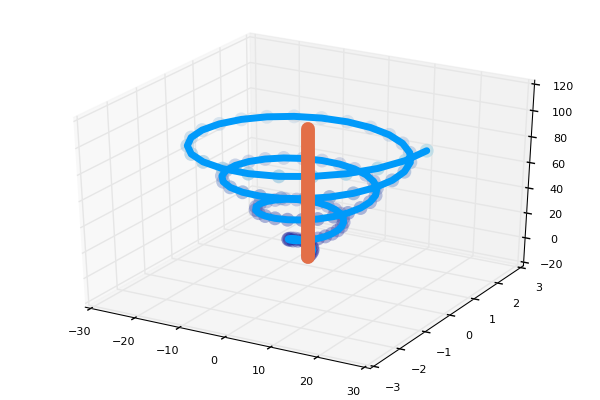

- Supported arguments: `annotation`, `axis`, `background_color`, `color_palette`, `fillalpha`, `fillcolor`, `fillrange`, `foreground_color`, `grid`, `group`, `guidefont`, `label`, `layout`, `legend`, `legendfont`, `linealpha`, `linecolor`, `linestyle`, `linetype`, `linewidth`, `markeralpha`, `markercolor`, `markershape`, `markersize`, `markerstrokecolor`, `markerstrokewidth`, `n`, `nbins`, `nc`, `nlevels`, `nr`, `show`, `size`, `smooth`, `tickfont`, `title`, `windowtitle`, `x`, `xflip`, `xlabel`, `xlims`, `xscale`, `xticks`, `y`, `yflip`, `ylabel`, `ylims`, `yrightlabel`, `yscale`, `yticks`, `z`, `zcolor`
- Supported values for axis: `:auto`, `:left`, `:right`
- Supported values for linetype: `:bar`, `:contour`, `:density`, `:heatmap`, `:hexbin`, `:hist`, `:hline`, `:line`, `:none`, `:path`, `:path3d`, `:scatter`, `:scatter3d`, `:steppost`, `:steppre`, `:sticks`, `:vline`
- Supported values for linestyle: `:auto`, `:dash`, `:dashdot`, `:dot`, `:solid`
- Supported values for marker: `:Plots.Shape`, `:auto`, `:cross`, `:diamond`, `:dtriangle`, `:ellipse`, `:heptagon`, `:hexagon`, `:none`, `:octagon`, `:pentagon`, `:rect`, `:star4`, `:star5`, `:star6`, `:star7`, `:star8`, `:utriangle`, `:xcross`
- Is `subplot`/`subplot!` supported? Yes

(Automatically generated: 2015-12-07T23:27:13)