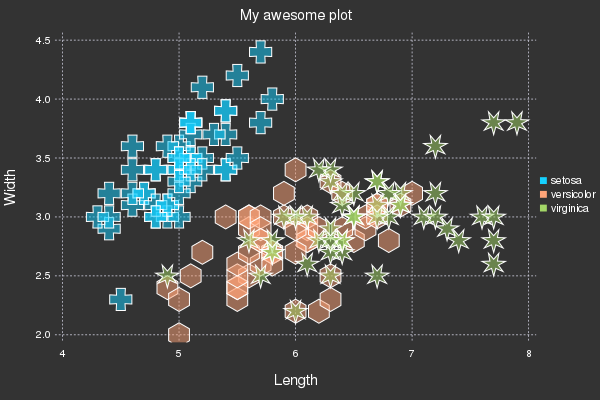

# Input Data

Part of the power of Plots lies is in the many combinations of allowed input data.
You shouldn't spend your time transforming and massaging your data into a specific format.
Let Plots do that for you.

There are a few rules to remember, and you'll be a power user in no time.

## Inputs are arguments, not keywords

While `plot(x = 1:10, y = rand(10))` will work as expected, it is not the preferred method.  In fact,
this method will simply call `plot(1:10, rand(10))`.  Instead,
use `plot(rand(10))`.  In this case, a single input will be mapped to the `:y` keyword, and a missing
value for `:x` will impute a unit range `1:10`.

The reason lies in the flexibility of Julia's multiple dispatch, where every combination of input types
can have unique behavior, when desired.

## Columns are series

In most cases, passing a (n x m) matrix of values (numbers, etc) will create `m` series, each with `n` data points.  This follows a consistent rule... vectors apply to a series, matrices apply to many series.  This rule carries into keyword arguments.  `plot(rand(10,4), color = [:red, :blue])` will create 4 series, each assigned the color vector [:red,:blue].  However, `plot(rand(10,4), color = [:red :blue])` will create 3 series, with series 1 and 3 taking the color `:red` and series 2 and 4 taking the color `:blue`.  The difference is that in the first example, it is a (2 x 1) column vector, and in the second example it is a (1 x 2) row vector (a Matrix).

## DataFrames support

As of this writing, the methods to support DataFrames are loaded after a call to `using DataFrames`.  The first argument should the `DataFrame`, and subsequent `Symbol` arguments will be mapped to the corresponding column in that `DataFrame`.  Example:

```julia
using DataFrames, Plots; gadfly()
using RDatasets; iris = dataset("datasets", "iris")

scatter(iris, :SepalLength, :SepalWidth, group=:Species,
        title = "My awesome plot", xlabel = "Length", ylabel = "Width",
        m=(0.5, [:+ :h :star7], 12), bg=RGB(.2,.2,.2))
```



## Functions

Functions can typically be used in place of input data, and they will be mapped as needed. 2D and 3D parametric plots can also be created, and ranges can be given as vectors or min/max.  For example, here are alternative methods to create the same plot:

```julia
using Plots
tmin = 0
tmax = 4π
tvec = linspace(tmin, tmax, 100)

plot(sin(tvec), cos(tvec))
plot(sin, cos, tvec)
plot(sin, cos, tmin, tmax)
```

Vectors of functions are allowed as well (one series per function).
