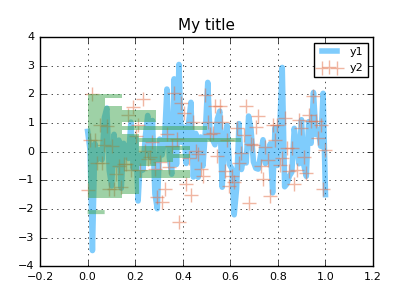
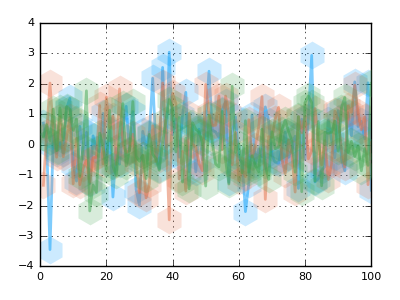
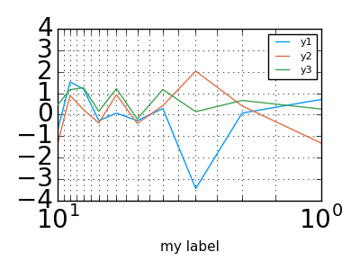
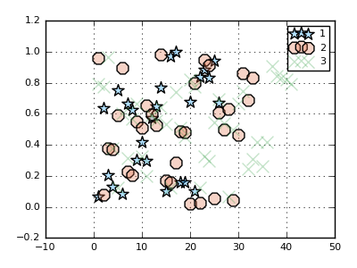

# Processing Pipeline

Plotting commands will send inputs through a series of preprocessing steps, in order to convert, simplify, and generalize.
The idea is that end-users need incredible flexibility in what (and how) they are able to make calls.  They may want total control over
plot attributes, or none at all.  There may be 8 attributes that are constant, but one that varies by data series.  We need to be able to
easily layer complex plots on top of each other, and easily define what they should look like.  Input data might come in any form.

I'll go through the steps that occur after a call to `plot()`, and show the power and flexibility that arises.

The examples can be found in [this notebook](https://github.com/tbreloff/ExamplePlots.jl/blob/master/notebooks/pipeline.ipynb).

### An example command

Suppose we have data:

```julia
n = 100
x, y = linspace(0,1,n), randn(n, 3)
```

and we'd like to visualize `x` against each column of `y`.  Here's a sample command in Plots:

```julia
using Plots; pyplot()
plot(x, y, line = (0.5, [4 1 0], [:path :scatter :density]),
    marker=(10, 0.5, [:none :+ :none]), fill=0.5,
    orientation = :h, title = "My title")
```



In this example, we have an input matrix, and we'd like to plot three series on top of each other, one for each column of data.
We create a row vector (1x3 matrix) of symbols to assign different visualization types for each series, set the orientation of the histogram, and set
alpha values.

For comparison's sake, this is somewhat similar to the following calls in PyPlot:

```julia
import PyPlot
fig = PyPlot.gcf()
fig[:set_size_inches](4,3,forward=true)
fig[:set_dpi](100)
PyPlot.clf()

PyPlot.plot(x, y[:,1], alpha = 0.5, "steelblue", linewidth = 4)
PyPlot.scatter(x, y[:,2], alpha = 0.5, marker = "+", s = 100, c="orangered")
PyPlot.plt[:hist](y[:,3], orientation = "horizontal", alpha = 0.5,
                          normed = true, bins=30, color="green",
                          linewidth = 0)

ax = PyPlot.gca()
ax[:xaxis][:grid](true)
ax[:yaxis][:grid](true)
PyPlot.title("My title")
PyPlot.legend(["y1","y2"])
PyPlot.show()
```

### Step 1: Replace aliases

In Plots, there are many aliased names for keyword arguments.  The reason is primarily to avoid the necessity of constantly looking up the API during plot building.
Generally speaking, many of the common names that you might expect to see are all supported.  I find that, personally, I've spent tons of time through my career referencing the documentation of
matplotlib and others, only because I couldn't remember the argument names.  Thanks to aliases, we can replace `line`, `marker`, and `fill` with aliases `l`, `m`, and `f` for compact commands.

The following commands are equivalent:

```julia
plot(y, lab = "my label", l = (2,0.5), m = (:hex,20,0.2,stroke(0)), key = false)

plot(y, label = "my label", line = (2,0.5), marker = (:hexagon,20,0.2,stroke(0)), legend = false)
```



### Step 2: Handle "Magic Arguments"

Some arguments encompass smart shorthands for setting many related arguments at the same time.  For example, passing a tuple of settings to the `xaxis` argument will allow the quick definition
of `xlabel`, `xlim`, `xticks`, `xscale`, `xflip`, and `tickfont`.  Plots uses type checking and multiple dispatch to smartly "figure out" which values apply to which argument.  These are equivalent:

```julia
plot(y, xaxis = ("my label", (0,10), 0:0.5:10, :log, :flip, font(20, "Courier")))

plot(y, xlabel = "my label", xlim = (0,10), xticks = 0:0.5:10,
        xscale = :log, xflip = true, tickfont = font(20, "Courier"))
```



Afterwards, there are some arguments which are simplified and compressed, such as converting the boolean setting `colorbar = false` to the internal description `colorbar = :none` as to allow
complex behavior without complex interface.


### Step 3: `_apply_recipe` callbacks

Users can add custom definitions of `_apply_recipe(d::KW, ...; ...)`, which is expected to return a tuple of the arguments for the converted plotting command.  Examples are best:

```julia
type MyVecWrapper
  v::Vector{Float64}
end
mv = MyVecWrapper(rand(100))

# add specialized attributes for custom types
function Plots._apply_recipe(d::Plots.KW, mv::MyVecWrapper; kw...)
    d[:markershape] = :circle
    d[:markersize] = 30
    (mv.v,)
end

subplot(
    plot(mv.v),
    plot(mv)
)
```


This hook gave us a nice way to swap out the input data and add custom visualization attributes for a user type.

### Step 4:  Apply groupings

```julia
scatter(rand(100), group = rand(1:3, 100), marker = (10,0.3,[:s :o :x]))
```



### Step 5:  

```julia
```


### Step 6:

```julia
```


### Step 7:  

```julia
```


